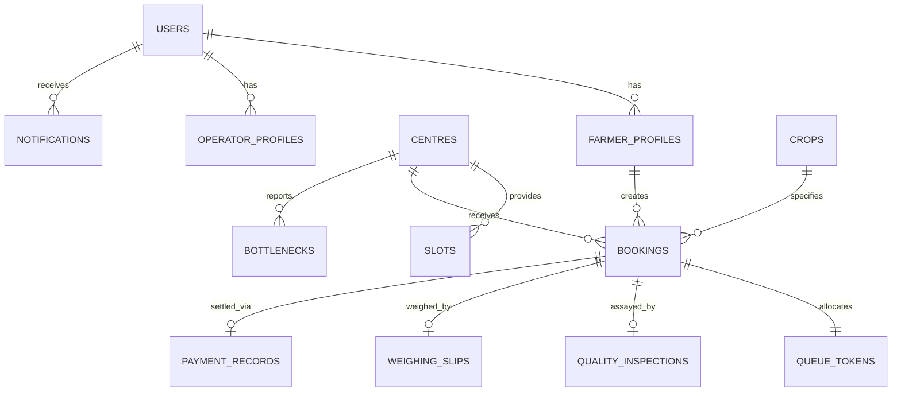
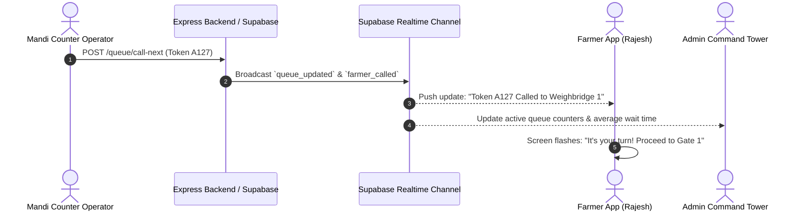
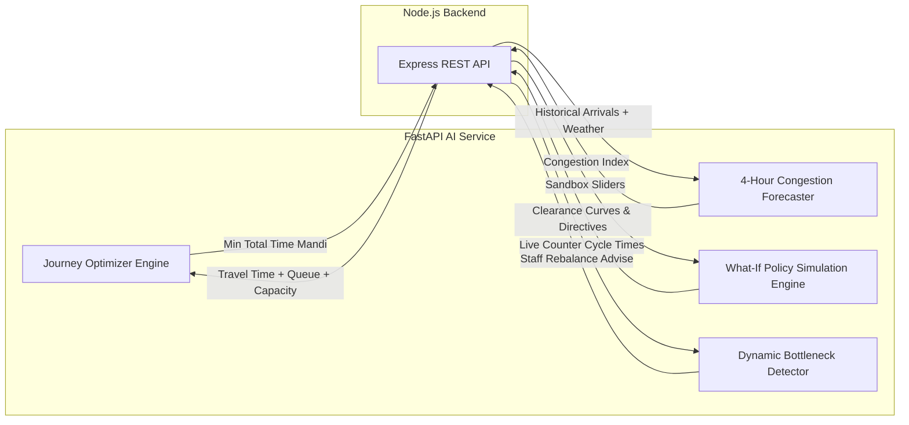

# KrishiQ (कृषि-Q) - Backend Requirements Specification
**Problem Statement:** SIH26032 - Intelligent Agricultural Procurement Coordination Platform  
**Target Backend Stack:** Node.js, Express.js, TypeScript, Supabase PostgreSQL, Supabase Auth, Supabase Realtime, Python + FastAPI (AI/ML), Firebase Cloud Messaging (FCM), Render  
**Document Purpose:** Complete technical specification derived strictly from the inspection and reverse-engineering of the existing frontend codebase (`KrishiQ-F`).

---

## A. CURRENT FRONTEND ARCHITECTURE

### 1. Framework & Core Dependencies
* **Framework:** React `19.2.8` with React DOM `19.2.8`
* **Build Tool & Bundler:** Vite `8.2.2` with `@vitejs/plugin-react` `6.1.0`
* **Language:** TypeScript `~6.0.2`
* **Routing:** `react-router-dom` `7.18.3`
* **Styling:** Tailwind CSS `v4.3.3` (with `@tailwindcss/vite` `4.3.3`, `postcss` `8.5.26`, `autoprefixer` `10.5.4`, and `clsx` / `tailwind-merge`)
* **Icons:** `lucide-react` `1.37.0`
* **Data Visualization & Charts:** `recharts` `3.10.1`
* **Linter:** `oxlint` `1.79.0`

### 2. Project Directory Structure
```text
KrishiQ-F/
├── public/
├── src/
│   ├── assets/                 # SVGs (vite, react) and hero artwork
│   ├── components/
│   │   ├── admin/              # Admin-specific components
│   │   │   ├── CentreStatusTable.tsx
│   │   │   ├── CongestionAdvisoryCard.tsx
│   │   │   └── WhatIfSimulatorCard.tsx
│   │   ├── centre/             # Centre Operator components
│   │   │   ├── BottleneckAlertCard.tsx
│   │   │   ├── OperatorQueueRow.tsx
│   │   │   └── QualityGradingModal.tsx
│   │   ├── common/             # Reusable UI primitives
│   │   │   ├── Badge.tsx
│   │   │   ├── Button.tsx
│   │   │   ├── Card.tsx
│   │   │   ├── Modal.tsx
│   │   │   ├── Navbar.tsx
│   │   │   ├── Sidebar.tsx
│   │   │   └── Toast.tsx
│   │   └── farmer/             # Farmer persona components
│   │       ├── CentreRecommendationCard.tsx
│   │       ├── LiveQueueVisualizer.tsx
│   │       ├── ProcurementStepper.tsx
│   │       ├── RescheduleModal.tsx
│   │       └── TokenSlipModal.tsx
│   ├── context/
│   │   └── KrishiQContext.tsx   # Centralized in-memory state & mock operations
│   ├── data/
│   │   └── mockData.ts          # Static mock records, centres, bookings, & queues
│   ├── i18n/                   # Internationalization (English + Hindi)
│   │   ├── locales/
│   │   │   ├── en.ts
│   │   │   └── hi.ts
│   │   ├── LanguageContext.tsx
│   │   ├── index.ts
│   │   └── types.ts
│   ├── pages/
│   │   ├── LandingPage.tsx      # Role switcher & platform launchpad
│   │   ├── admin/
│   │   │   ├── AdminAnalytics.tsx
│   │   │   ├── AdminCentres.tsx
│   │   │   ├── AdminDashboard.tsx
│   │   │   └── AdminSimulator.tsx
│   │   ├── centre/
│   │   │   ├── CentreAnalytics.tsx
│   │   │   ├── CentreDashboard.tsx
│   │   │   ├── CentreProcurement.tsx
│   │   │   └── CentreQueue.tsx
│   │   └── farmer/
│   │       ├── FarmerBookSlot.tsx
│   │       ├── FarmerCentres.tsx
│   │       ├── FarmerDashboard.tsx
│   │       ├── FarmerNotifications.tsx
│   │       ├── FarmerPayment.tsx
│   │       ├── FarmerProcurement.tsx
│   │       └── FarmerQueue.tsx
│   ├── types/
│   │   └── index.ts            # Canonical domain TypeScript interfaces
│   ├── utils/
│   │   └── calculations.ts     # Currency/unit formatters, 8 stages list, & What-If simulator math
│   ├── App.css
│   ├── App.tsx                 # Route declarations, Shell layout, bottom navigation
│   ├── index.css               # Design system variables & base styling
│   └── main.tsx                # React DOM root bootstrapping
├── package.json
└── tsconfig.json
```

### 3. All Major Pages & Screens (16 Total)
| Persona / Area | Route | Screen Name | Key Purpose |
| :--- | :--- | :--- | :--- |
| **Public / Demo** | `/` | `LandingPage.tsx` | Platform introduction & persona switchboard (Farmer, Operator, Admin). |
| **Farmer** | `/farmer/dashboard` | `FarmerDashboard.tsx` | Farmer home screen: Dynamic greeting, quick action cards, AI recommended centre, SVG mock route map, active booking status, and queue progress bar. |
| **Farmer** | `/farmer/centres` | `FarmerCentres.tsx` | Search, filter (crop, date, wait, distance), and sort Mandi centres in list or full-map view. |
| **Farmer** | `/farmer/book-slot` | `FarmerBookSlot.tsx` | 4-stage slot booking wizard (Centre Selection → Crop & Quantity → Date & Time Window → Summary & Confirmation) with instant token generation. |
| **Farmer** | `/farmer/queue` | `FarmerQueue.tsx` | Live token queue tracker (Serving token, farmers ahead, expected wait time, gate entry order A121–A127, interactive demo queue stepper). |
| **Farmer** | `/farmer/procurement` | `FarmerProcurement.tsx` | 8-stage digital provenance tracker with moisture & FAQ quality assay slips and weighbridge info. |
| **Farmer** | `/farmer/payment` | `FarmerPayment.tsx` | Official DBT settlement ledger, MSP price calculation, PFMS ref ID, UTR number, bank details, and print receipt. |
| **Farmer** | `/farmer/notifications` | `FarmerNotifications.tsx` | Notification inbox with unread badges, mark as read, and toggle read status. |
| **Centre Operator** | `/centre/dashboard` | `CentreDashboard.tsx` | High-tempo workstation console: Shift status, capacity utilization meter, 4 KPI cards, weighbridge bottleneck alert, active serving card, next farmer station, and today's intake log. |
| **Centre Operator** | `/centre/queue` | `CentreQueue.tsx` | Operational queue table with status filters (Waiting, Serving, Completed), search, Call Next Token action, and Quality Grading trigger. |
| **Centre Operator** | `/centre/procurement` | `CentreProcurement.tsx` | Daily procurement total quintals, weighbridge calibration certification status, average moisture %, and shift inspection log. |
| **Centre Operator** | `/centre/analytics` | `CentreAnalytics.tsx` | Hourly arrivals vs. processed lots bar chart, and station cycle time breakdown (Gate, QC, Weighbridge, Unloading, Documentation). |
| **Admin** | `/admin/dashboard` | `AdminDashboard.tsx` | State command tower: 5 unified metrics, 70/30 district map & Needs Attention panel, KrishiQ AI insight strip, congestion trend area chart, capacity utilisation bar chart, and top Mandi performance list. |
| **Admin** | `/admin/centres` | `AdminCentres.tsx` | State-wide APMC Mandi directory table with status filters (Normal, Warning, Critical) and search. |
| **Admin** | `/admin/simulator` | `AdminSimulator.tsx` | What-If policy sandbox testing arrival surges, auxiliary counters, QC inspectors, and shift extensions with before/after impact calculations and hourly clearance curves. |
| **Admin** | `/admin/analytics` | `AdminAnalytics.tsx` | State-level procurement analytics: Total procurement, DBT cleared amount, average wait times, active Mandis, and hourly inflow vs. queue length charts. |

### 4. Major Components Breakdown
* **Common Primitives:**
  * `Navbar.tsx`: Sticky navigation bar with mobile sidebar toggle, expand/collapse trigger, breadcrumbs, English/Hindi language dropdown, Light/Dark mode toggle, notification dropdown with unread badge and eye toggle, and user profile persona switcher with "Reset Data" option.
  * `Sidebar.tsx`: Role-aware desktop sidebar and mobile slide-over navigation with dynamic badges (`#A127`, `31 Queue`, `42 Active`, unread notification count) and helpline support footer (`1800-180-1551`).
  * `Card.tsx`, `Button.tsx`, `Badge.tsx`, `Modal.tsx`, `Toast.tsx`: Unified design system components.
* **Farmer Components:**
  * `CentreRecommendationCard.tsx`: Highlights recommended centre with time saved rationale (~2h 28m) and 1-click booking.
  * `LiveQueueVisualizer.tsx`: Visual sequential queue stream (`✓ Completed`, `● Serving`, `○ Waiting`, `★ You`).
  * `ProcurementStepper.tsx`: 7/8-stage horizontal (desktop) and vertical (mobile) pipeline with current inspection metrics.
  * `TokenSlipModal.tsx`: Digital Mandi gate pass modal with token number, QR code, barcode, declared quantity, and entry document checklist.
  * `RescheduleModal.tsx`: Modal to switch slot date, time window, or Mandi centre with dynamic wait time recalculation.
* **Centre Operator Components:**
  * `BottleneckAlertCard.tsx`: Detects choke points (e.g. Weighbridge 2) with 1-click operator rebalancing.
  * `OperatorQueueRow.tsx`: Table row with action buttons: "Start Intake", "Complete & Pass", or "Verified".
  * `QualityGradingModal.tsx`: Input modal for Fair Average Quality (FAQ) parameters (moisture %, dockage %, foreign matter %, grade A/FAQ/Below FAQ) and electronic weighbridge gross/tare inputs calculating net quintals.
* **Admin Components:**
  * `CentreStatusTable.tsx`: Full table of centres with utilization bars, wait times, active counters, and status badges.
  * `CongestionAdvisoryCard.tsx`: AI early warning card with modal to dispatch automated SMS rerouting directives to farmers.
  * `WhatIfSimulatorCard.tsx`: Interactive parameter slider component with Recharts area chart showing unmitigated vs. mitigated clearance curves.

### 5. Existing Local State Management
* **React Context (`KrishiQContext.tsx`):**
  * `role`: Current user role (`farmer` | `centre` | `admin`).
  * `centres`: Array of `ProcurementCentre` objects initialized from `MOCK_CENTRES`.
  * `selectedCentre`: Active centre object.
  * `farmerBooking`: Active `FarmerBooking` object initialized from `INITIAL_FARMER_BOOKING`.
  * `queueItems`: Array of `QueueItem` objects initialized from `INITIAL_QUEUE_ITEMS`.
  * `notifications`: Array of `NotificationItem` objects initialized from `MOCK_NOTIFICATIONS`.
  * `toasts`: Dynamic queue of transient alert messages.
  * `simParams`: Object storing What-If slider parameters.
  * Context helper methods: `bookSlot()`, `rescheduleSlot()`, `advanceFarmerStage()`, `callNextFarmer()`, `decrementQueueCount()`, `startProcessingItem()`, `completeProcessingItem()`, `resolveBottleneck()`, `markNotificationAsRead()`, `toggleNotificationRead()`, `markAllNotificationsAsRead()`, `resetAllData()`.
  * Live heartbeat effect: An 8-second interval (`livePing`) simulating a live connection ticker.
* **Internationalization Context (`LanguageContext.tsx`):**
  * Manages `language` (`en` | `hi`), translations lookup via `t()`, transliterations for crop names (`formatCrop`), locations (`formatLocation`), time slots (`formatTimeSlot`), dates (`formatDate`), and dynamic greetings (`getDynamicGreeting`).

### 6. Existing `localStorage` & `sessionStorage` Usage
* **`localStorage` Keys:**
  1. `"krishiq_theme"`: Stores `"light"` or `"dark"` mode preference.
  2. `"krishiq_language"`: Stores `"en"` or `"hi"` language selection.
* **`sessionStorage`:** Not used anywhere in the codebase.

### 7. Existing API Calls
* **Zero (0) API calls exist.** There are no `fetch()`, `axios`, or WebSocket calls anywhere in the project. All actions update in-memory React state variables.

### 8. Existing Mock Data (`src/data/mockData.ts`)
* `CROP_MSP_RATES`: Fixed government Minimum Support Prices: Wheat (₹2,275), Paddy (₹2,300), Soybean (₹4,892), Maize (₹2,090), Cotton (₹7,121), Mustard (₹5,650).
* `MOCK_CENTRES`: 5 APMC Mandis in Indore district:
  1. *Shivaji Nagar (Centre B)*: 7.2 km, 6 counters, normal status, recommended.
  2. *Dhar Road (Centre A)*: 4.1 km, 3 counters, critical status (136% load, 165 min wait).
  3. *Sanwer Hub (Centre C)*: 14.8 km, 5 counters, normal status.
  4. *Depalpur Cooperative (Centre D)*: 18.5 km, 4 counters, warning status (88% load).
  5. *Mhow APMC Yard (Centre E)*: 22.1 km, 4 counters, normal status.
* `INITIAL_FARMER_BOOKING`: Token `#A127` for farmer Rajesh Sharma (`MP-IND-2026-8841`), 65 Qtl Sharbati Wheat, Shivaji Nagar Centre, Stage 4 (Quality Check), gross MSP ₹1,47,875.
* `INITIAL_QUEUE_ITEMS`: 10 queue tokens (`A121` through `A130`) across various stages.
* `MOCK_NOTIFICATIONS`: 3 notifications (queue update, slot reminder, quality check passed).
* `HOURLY_ANALYTICS_DATA`: 10 hourly data points (08:00 AM to 05:00 PM) tracking arrivals, throughput, queue length, and wait times.
* `STAGE_CYCLE_TIMES`: Baseline benchmarks for Gate Intake (4m), Moisture QC (9m), Weighbridge (14m), Unloading (11m), and Documentation (5m).
* `DISTRICT_ADMIN_STATS`: Aggregate metrics (42 centres, 418 farmers waiting, 48,250 Qtl procured, ₹8.42 Cr DBT cleared).

### 9. Summary of Actions Using Fake / Mock Operations
1. **Persona Switching:** Immediate state replacement in navbar without credentials or token issuance.
2. **Slot Booking:** Random string generation (`"A-" + (125..140)`), calculating gross MSP locally, appending to mock notifications.
3. **Rescheduling:** Overwriting in-memory `farmerBooking` with selected date/time.
4. **Queue Simulation:** Local step increment (0 to 3) shifting serving token from `A124` to `A127` and triggering toast notifications.
5. **Operator Intake & Call Next:** Locally updating item status from `WAITING` to `SERVING` and `COMPLETED`.
6. **Quality & Weighbridge Entry:** Form inputs processed inside `QualityGradingModal` without database persistence.
7. **Bottleneck Resolution:** Hardcoded math cutting wait time by 60% and utilization by 40% in React state.
8. **Admin SMS Directives:** Sets `directiveIssued = true` and shows a confirmation toast.
9. **What-If Simulation:** Uses client-side algebraic formulas in `calculations.ts` rather than server-side historical regression or ML inference.

---

## B. USER ROLES

The frontend defines three distinct user roles (`UserRole = "farmer" | "centre" | "admin"`):

```mermaid
graph TD
    User([Platform User]) --> RoleSelection{Assigned Role}
    RoleSelection -->|Farmer| FarmerRole[Farmer Persona]
    RoleSelection -->|Centre Operator| CentreRole[Centre Operator Persona]
    RoleSelection -->|Administrator| AdminRole[State Administrator Persona]

    FarmerRole --> F1[Discover Mandis & Travel Times]
    FarmerRole --> F2[Book & Reschedule 30-min Slots]
    FarmerRole --> F3[Track Real-Time Queue & Token #]
    FarmerRole --> F4[View 8-Stage Procurement Progress]
    FarmerRole --> F5[Inspect DBT Payment & PFMS/UTR Slip]
    FarmerRole --> F6[View/Print Gate Pass QR Code]

    CentreRole --> C1[Monitor Workstation Shift Capacity]
    CentreRole --> C2[Call Next Token to Weighbridge/QC]
    CentreRole --> C3[Enter FAQ Moisture & Assay Readings]
    CentreRole --> C4[Record Electronic Gross & Tare Weighments]
    CentreRole --> C5[Rebalance Bottlenecks / Reassign Counters]
    CentreRole --> C6[Inspect Shift Procurement Ledger]

    AdminRole --> A1[Monitor Regional Command Tower - 42 Mandis]
    AdminRole --> A2[Receive 4-Hour Congestion Early Warnings]
    AdminRole --> A3[Dispatch Automated SMS Reroute Directives]
    AdminRole --> A4[Run What-If Policy Surge Simulations]
    AdminRole --> A5[Analyze Regional Throughput & DBT Metrics]
```



### 1. Farmer (`farmer`)
* **Identity in Mock:** Rajesh Sharma (ID: `MP-IND-2026-8841`, Phone: `+91 98260 41289`, Village: Bilaspur, Depalpur, Indore).
* **Capabilities:**
  * View personalized dashboard with dynamic time greeting and crop details.
  * Search and discover authorized Mandis filtered by crop, distance, predicted wait time, and recommended badge.
  * Book appointment slots (1-500 Quintals) choosing centre, crop variety, date, and 30-minute time window.
  * Reschedule booked slots to alternative days, time slots, or centres.
  * Track live token position (`#A127`), count of farmers ahead, and estimated service time.
  * View 8-stage digital provenance tracker (Registered → Slot Booked → Arrived → Quality Check → Weighing → Procured → Payment Initiated → Payment Credited).
  * Review official Fair Average Quality (FAQ) inspection results (moisture %, dockage %, foreign matter %, Grade A/FAQ).
  * Review electronic gross/tare weighbridge slips (gross kg, tare kg, net quintals, bag count).
  * Review DBT bank disbursement status (MSP calculation, PFMS ref ID, UTR number, bank account masking `XXXX-XXXX-4092`).
  * View and print official digital Mandi Gate Pass with security QR code and entry barcode.
  * Receive real-time queue shift notifications and slot reminders.

### 2. Centre Operator (`centre`)
* **Identity in Mock:** Shivaji Nagar Operations Console (Centre B, Code: `MP-IND-02`).
* **Capabilities:**
  * Monitor live operational status (open/closed, shift information, capacity load gauge e.g. 68%).
  * Track 4 key operational KPIs: Today's Bookings (148), Current Queue Count (31), Average Wait Time (42 min), Today's Procurement (3,240 Qtl).
  * Receive active bottleneck advisories (e.g. Weighbridge 2 backlog) with 1-click operator rebalancing.
  * View active serving workstation card with "Complete Stage" button.
  * View next farmer workstation card with "Call Next Token" and "Call Again" actions.
  * Inspect visual queue sequence timeline (`KQ-018 → KQ-019 → KQ-020 → KQ-021`).
  * Filter and search queue intake log across Waiting, Serving, and Completed statuses.
  * Launch electronic quality grading and weighbridge modal:
    * Enter moisture %, dockage %, foreign matter %, and grade.
    * Enter gross weight (kg) and tare weight (kg) with automatic net quintals calculation.
    * Submit and generate procurement receipt.
  * View procurement and quality ledger, weighbridge calibration records, and print shift ledger.
  * View hourly intake vs. processing charts and station cycle time breakdown.

### 3. State Government Administrator (`admin`)
* **Identity in Mock:** Admin Director, State Agricultural Marketing Board (Indore Division).
* **Capabilities:**
  * Supervise regional command desk across 42 active Mandis in the district.
  * Monitor network metric strip: Active Centres (42), Average Wait Time (31 min), Network Capacity (64%), Farmers Served Today (3,920), Critical Centres (1).
  * Inspect 70/30 regional network map with live telemetry pins colored by congestion status.
  * Inspect "Needs Attention" alert panel with quick action buttons (e.g. investigate Dhar Road congestion, view Rajendra Mandi).
  * Review AI early warning advisories and dispatch state directives (modal to send SMS reroute advisories to 45 farmers).
  * Browse the complete Mandi Directory with search, status filters, queue counts, utilization %, and wait times.
  * Access the What-If Policy Simulator:
    * Adjust arrival surge slider (+0 to +400 farmers).
    * Adjust active counters slider (1 to 10).
    * Adjust quality staff slider (1 to 12 inspectors).
    * Adjust extended operating hours slider (0 to 4 hours).
    * Target specific Mandis.
    * View unmitigated vs. mitigated wait times, utilization %, bottleneck predictions, and automated policy directives.
    * Compare hourly queue accumulation curves on Recharts area charts.
  * Analyze state-level analytics: Hourly procurement inflow vs. processed volumes, average queue length by hour, and total cleared DBT funds.

---

## C. BACKEND REQUIREMENTS

Based strictly on the UI and functionality present in the frontend, the backend must deliver:

1. **Authentication & Identity Management:**
   * Supabase Auth integration supporting mobile phone + OTP (or password) authentication for farmers, email/password for centre operators and administrators.
   * Role-based access control (RBAC) enforcing distinct route and resource permissions for `farmer`, `centre`, and `admin`.
   * Secure session management via JWT.

2. **Farmer Profile & Landholding Registry:**
   * Farmer profile storage (Aadhaar verification flag, farmer registration ID, mobile number, village, tehsil, district, state).
   * Verified land allotment data and maximum permissible procurement quota (capped at 500 Quintals as enforced in `FarmerBookSlot.tsx`).
   * Registered bank details for Direct Benefit Transfer (bank name, masked account number, IFSC prefix).

3. **Procurement Centre Management:**
   * Directory of APMC Mandi centres (code, name, district, state, GPS coordinates, operating hours, daily capacity limit, number of physical counters).
   * Dynamic status calculation (`normal`, `warning`, `critical`) based on live queue load vs. daily capacity.
   * Active bottleneck tracking per centre (stage name, count, severity, recommendation).

4. **Dynamic Appointment Slot Booking Engine:**
   * 30-minute intake window slots per centre (e.g. 10:00-10:30, 10:30-11:00, etc.).
   * Concurrency control and slot capacity enforcement to prevent gate overbooking.
   * Generation of structured token numbers (e.g. `A-127`) and booking IDs (`BK-2026-9042`).
   * Rescheduling endpoint supporting date, time window, or centre migration.

5. **Live Queue & Token Management Engine:**
   * Sequential FIFO queue state per centre per day.
   * Queue status transitions: `WAITING` → `SERVING` → `COMPLETED` (or `NO_SHOW`).
   * Counter assignment (e.g., "Counter 1", "Weighbridge 1", "QC Station A").
   * Calculation of live queue position, count of farmers ahead, and estimated wait minutes based on average counter throughput.
   * "Call Next Farmer" event broadcasting.

6. **8-Stage Procurement Workflow & Electronic Assaying:**
   * Sequential stage progression tracking:
     1. `REGISTERED` (Farmer land & Aadhaar verified)
     2. `SLOT_BOOKED` (Appointment time window reserved)
     3. `ARRIVED` (Gate entry token scanned)
     4. `QUALITY_CHECK` (Fair Average Quality inspection)
     5. `WEIGHING` (Gross & tare weight electronic recording)
     6. `PROCURED` (Depot handover & receipt generation)
     7. `PAYMENT_INITIATED` (PFMS DBT payment batch created)
     8. `PAYMENT_COMPLETED` (Bank credit confirmation)
   * Quality inspection data capture: Moisture %, dockage %, foreign matter %, grade (`Grade A`, `FAQ`, `Grade B`, `Below FAQ`), inspector ID, timestamp.
   * Weighbridge data capture: Gross weight (kg), tare weight (kg), net weight (quintals), bag count, weighbridge ID, timestamp.

7. **MSP & DBT Payment Ledger Engine:**
   * Government Minimum Support Price (MSP) lookup table by crop.
   * Gross procurement valuation calculation (`quantityQuintals * mspRate`).
   * Mandi fee deduction tracking (zero for DBT direct sales).
   * Payment record generation with PFMS reference ID, bank reference, UTR number, initiated date, and expected credit date.

8. **Real-Time Notification & Messaging:**
   * In-app notification creation, read status tracking, and unread counters.
   * Real-time WebSocket event dispatch for queue updates and stage advancements.
   * Push notification integration via Firebase Cloud Messaging (FCM) for mobile devices.

9. **Centre Operator Workstation APIs:**
   * Operator dashboard KPI aggregations (daily bookings count, waiting queue count, average wait time, total procured quintals).
   * Workstation station actions: Call next, start intake, complete stage, and shift operator rebalancing.

10. **Admin Command Tower & What-If Simulation Services:**
    * State-wide Mandi telemetry aggregation (active centres, wait times, capacity %, total arrivals, critical alerts).
    * "Needs Attention" alert generation.
    * Directive dispatching (triggering reroute notifications to farmers).
    * Python/FastAPI integration for running simulation calculations, predicting congestion 4 hours in advance, and calculating optimal centre recommendations.

---

## D. DATA ENTITIES

The following entities are strictly required based on the data fields and interactions present in the frontend:



### 1. `User`
* **Reasoning:** Required for authentication and role authorization (`farmer`, `centre`, `admin`).
* **Fields:** `id`, `email`, `phone`, `role` (`farmer` | `centre` | `admin`), `created_at`, `updated_at`.

### 2. `FarmerProfile`
* **Reasoning:** Needed because `FarmerDashboard.tsx`, `FarmerBookSlot.tsx`, and `TokenSlipModal.tsx` display specific farmer attributes like registration ID, village, tehsil, district, Aadhaar verification badge, and default bank accounts.
* **Fields:** `id`, `user_id`, `farmer_reg_id` (`MP-IND-2026-8841`), `full_name`, `phone`, `village`, `tehsil`, `district`, `state`, `aadhaar_verified` (boolean), `bank_name`, `bank_account_ending`, `ifsc_prefix`, `max_allotment_quintals`.

### 3. `ProcurementCentre`
* **Reasoning:** Directly maps to `ProcurementCentre` in `types/index.ts` and `MOCK_CENTRES`. Required for centre discovery, capacity monitoring, and booking destination.
* **Fields:** `id`, `name`, `code` (`MP-IND-02`), `district`, `state`, `latitude`, `longitude`, `active_counters`, `total_capacity_per_day`, `operating_hours`, `status` (`normal` | `warning` | `critical`).

### 4. `CropMSP`
* **Reasoning:** Mapped from `CROP_MSP_RATES` and `CropType` in `types/index.ts`. Used in slot booking, DBT estimation, and payment calculation.
* **Fields:** `id`, `crop_name` (`Wheat`, `Paddy`, `Soybean`, `Maize`, `Cotton`, `Mustard`), `msp_rate_per_quintal`, `effective_season`, `max_moisture_limit_percent`, `max_dockage_limit_percent`, `max_foreign_matter_percent`.

### 5. `Slot`
* **Reasoning:** Required by `FarmerBookSlot.tsx` to display available 30-minute time windows and enforce capacity quotas per day per centre.
* **Fields:** `id`, `centre_id`, `slot_date`, `start_time` (`10:00 AM`), `end_time` (`10:30 AM`), `max_capacity_farmers`, `booked_count`.

### 6. `Booking` (FarmerBooking)
* **Reasoning:** Directly maps to `FarmerBooking` in `types/index.ts`. Central record connecting farmer, centre, slot, token, stage progression, and receipts.
* **Fields:** `id` (`BK-2026-9042`), `farmer_id`, `centre_id`, `slot_id`, `crop_id`, `variety` (`Sharbati Grade A`), `quantity_quintals`, `current_stage_number` (1 to 8), `status` (`CONFIRMED`, `RESCHEDULED`, `CANCELLED`, `COMPLETED`), `created_at`, `updated_at`.

### 7. `QueueToken`
* **Reasoning:** Maps to `QueueItem` in `types/index.ts` and `FarmerQueue.tsx` / `CentreQueue.tsx`. Manages live order, counter assignments, and serving status.
* **Fields:** `id`, `booking_id`, `centre_id`, `token_number` (`A127`), `queue_position`, `status` (`WAITING`, `SERVING`, `COMPLETED`, `NO_SHOW`), `assigned_counter`, `arrived_at`, `service_started_at`, `service_completed_at`, `estimated_wait_minutes`.

### 8. `QualityInspection`
* **Reasoning:** Directly maps to `QualityInspection` in `types/index.ts` and inputs from `QualityGradingModal.tsx`.
* **Fields:** `id`, `booking_id`, `inspector_user_id`, `moisture_percent`, `dockage_percent`, `foreign_matter_percent`, `grade` (`Grade A`, `FAQ`, `Grade B`, `Below FAQ`), `passed` (boolean), `inspected_at`.

### 9. `WeighingSlip`
* **Reasoning:** Directly maps to `WeighingSlip` in `types/index.ts` and weighbridge inputs from `QualityGradingModal.tsx`.
* **Fields:** `id`, `booking_id`, `operator_user_id`, `weighbridge_id` (`WB-01-DIGITAL`), `gross_weight_kg`, `tare_weight_kg`, `net_weight_quintals`, `bag_count`, `weighed_at`.

### 10. `PaymentRecord`
* **Reasoning:** Directly maps to `PaymentRecord` in `types/index.ts` and the receipt displayed in `FarmerPayment.tsx`.
* **Fields:** `id`, `booking_id`, `farmer_id`, `msp_rate_per_quintal`, `gross_amount`, `mandi_fee_deduction`, `net_payable_amount`, `bank_name`, `account_ending`, `ifsc_prefix`, `pfms_reference_id`, `utr_number`, `status` (`PENDING`, `INITIATED`, `COMPLETED`), `initiated_at`, `completed_at`.

### 11. `Notification`
* **Reasoning:** Directly maps to `NotificationItem` in `types/index.ts` and the notification bell dropdown in `Navbar.tsx` and `/farmer/notifications`.
* **Fields:** `id`, `user_id`, `title`, `message`, `type` (`info`, `success`, `warning`, `critical`), `read` (boolean), `action_url`, `created_at`.

### 12. `CentreBottleneck`
* **Reasoning:** Directly maps to `BottleneckInfo` in `ProcurementCentre` and `BottleneckAlertCard.tsx`.
* **Fields:** `id`, `centre_id`, `stage_name`, `waiting_count`, `severity` (`warning`, `critical`), `recommendation_text`, `counter_suggestion`, `resolved` (boolean), `created_at`.

---

## E. API REQUIREMENTS

Below is the complete specification of REST API endpoints needed by the frontend:

### 1. Authentication & User Profile
| Method | Endpoint | Purpose | Request Data | Response Data | Auth Req | Role Allowed |
| :--- | :--- | :--- | :--- | :--- | :--- | :--- |
| `POST` | `/api/v1/auth/login` | Authenticate user & issue JWT | `{ phone, otp }` or `{ email, password }` | `{ token, user: { id, role, name } }` | No | Public |
| `GET` | `/api/v1/auth/me` | Fetch authenticated user profile | None | `{ id, email, phone, role, profile: {...} }` | Yes | All roles |
| `POST` | `/api/v1/auth/logout` | Invalidate current session | None | `{ success: true }` | Yes | All roles |

### 2. Farmer Portal Endpoints
| Method | Endpoint | Purpose | Request Data | Response Data | Auth Req | Role Allowed |
| :--- | :--- | :--- | :--- | :--- | :--- | :--- |
| `GET` | `/api/v1/farmer/dashboard` | Fetch farmer home dashboard data | None | `{ booking: FarmerBooking, recommendedCentre: ProcurementCentre, activeQueueSummary: {...} }` | Yes | `farmer` |
| `GET` | `/api/v1/farmer/centres` | List Mandis with distance & wait times | Query: `?crop=Wheat&date=...&maxDistance=25` | `{ centres: ProcurementCentre[] }` | Yes | `farmer` |
| `GET` | `/api/v1/farmer/centres/:id/slots` | Fetch available 30-min booking slots | Query: `?date=2026-08-29` | `{ slots: [{ id, timeWindow, availableCapacity }] }` | Yes | `farmer` |
| `POST` | `/api/v1/farmer/bookings` | Book a new procurement slot | `{ centreId, crop, variety, quantityQuintals, date, timeSlot }` | `{ success: true, booking: FarmerBooking, token: QueueItem }` | Yes | `farmer` |
| `POST` | `/api/v1/farmer/bookings/:id/reschedule` | Reschedule booking to another slot/centre | `{ newCentreId, newDate, newTimeSlot }` | `{ success: true, booking: FarmerBooking }` | Yes | `farmer` |
| `GET` | `/api/v1/farmer/bookings/:id/gate-slip` | Get official gate pass slip & QR data | None | `{ booking: FarmerBooking, qrPayload: string, barcode: string }` | Yes | `farmer` |
| `GET` | `/api/v1/farmer/queue` | Get live queue status for active booking | None | `{ tokenNumber, queuePosition, servingToken, farmersAhead, estWaitMinutes, queueStream: QueueItem[] }` | Yes | `farmer` |
| `GET` | `/api/v1/farmer/procurement/:id` | Get 8-stage procurement status & QC assay | None | `{ currentStageNumber, stages: [...], qualityCheck: QualityInspection, weighing: WeighingSlip }` | Yes | `farmer` |
| `GET` | `/api/v1/farmer/payment/:id` | Get DBT settlement & transaction slip | None | `{ payment: PaymentRecord }` | Yes | `farmer` |
| `GET` | `/api/v1/farmer/notifications` | Get farmer notification inbox | Query: `?unreadOnly=false` | `{ notifications: NotificationItem[], unreadCount: number }` | Yes | `farmer` |
| `PATCH` | `/api/v1/farmer/notifications/:id/read` | Mark individual notification as read/unread | `{ read: boolean }` | `{ success: true }` | Yes | `farmer` |
| `POST` | `/api/v1/farmer/notifications/mark-all-read` | Mark all notifications as read | None | `{ success: true }` | Yes | `farmer` |

### 3. Centre Operator Portal Endpoints
| Method | Endpoint | Purpose | Request Data | Response Data | Auth Req | Role Allowed |
| :--- | :--- | :--- | :--- | :--- | :--- | :--- |
| `GET` | `/api/v1/centre/dashboard` | Get operator console shift status & KPIs | None | `{ centre: ProcurementCentre, stats: { todayBookings, queueCount, avgWaitTime, todayProcured }, currentlyServing, nextFarmer, bottleneck: BottleneckInfo }` | Yes | `centre` |
| `GET` | `/api/v1/centre/queue` | List queue items for active centre | Query: `?status=WAITING&search=...` | `{ queueItems: QueueItem[] }` | Yes | `centre` |
| `POST` | `/api/v1/centre/queue/call-next` | Call next waiting farmer to station | `{ counterId: "Counter 1" }` | `{ calledToken: QueueItem, nextInLine: QueueItem }` | Yes | `centre` |
| `POST` | `/api/v1/centre/queue/:id/start-intake` | Mark farmer intake active at counter | None | `{ queueItem: QueueItem }` | Yes | `centre` |
| `POST` | `/api/v1/centre/inspections` | Record electronic QC assay & grading | `{ bookingId, moisturePercent, dockagePercent, foreignMatterPercent, grade }` | `{ success: true, qualityCheck: QualityInspection }` | Yes | `centre` |
| `POST` | `/api/v1/centre/weighments` | Record electronic gross & tare weights | `{ bookingId, weighbridgeId, grossWeightKg, tareWeightKg, bagCount }` | `{ success: true, weighingSlip: WeighingSlip, netQuintals: number }` | Yes | `centre` |
| `POST` | `/api/v1/centre/queue/:id/complete` | Complete intake & advance to depot procurement | None | `{ success: true, paymentRecord: PaymentRecord }` | Yes | `centre` |
| `POST` | `/api/v1/centre/bottlenecks/:id/rebalance` | Apply station load rebalancing directive | None | `{ success: true, updatedCentre: ProcurementCentre }` | Yes | `centre` |
| `GET` | `/api/v1/centre/procurement-ledger` | Shift procurement ledger & calibration data | Query: `?date=today` | `{ totalProcuredQuintals, calibrationStatus, recentAssays: [...] }` | Yes | `centre` |
| `GET` | `/api/v1/centre/analytics` | Hourly arrivals, processed lots, cycle times | None | `{ hourlyData: [...], stageCycleTimes: [...] }` | Yes | `centre` |

### 4. Government Administrator Portal Endpoints
| Method | Endpoint | Purpose | Request Data | Response Data | Auth Req | Role Allowed |
| :--- | :--- | :--- | :--- | :--- | :--- | :--- |
| `GET` | `/api/v1/admin/dashboard` | District procurement command tower summary | None | `{ networkStats: DISTRICT_ADMIN_STATS, needsAttention: [...], telemetryMap: [...], hourlyCongestion: [...] }` | Yes | `admin` |
| `GET` | `/api/v1/admin/centres` | List all regional Mandis with loads | Query: `?status=all&search=...` | `{ centres: ProcurementCentre[] }` | Yes | `admin` |
| `GET` | `/api/v1/admin/centres/:id` | Detailed telemetry & bottlenecks for a centre | None | `{ centre: ProcurementCentre, queueTrend: [...], bottleneckHistory: [...] }` | Yes | `admin` |
| `POST` | `/api/v1/admin/directives/dispatch` | Send automated reroute / policy SMS to farmers | `{ targetCentreId, alternativeCentreId, tokenRange, message }` | `{ success: true, farmersNotifiedCount: number }` | Yes | `admin` |
| `POST` | `/api/v1/admin/simulator/run` | Execute What-If surge policy simulation | `{ targetCentreId, additionalFarmers, activeCounters, qualityStaff, extendedHours }` | `SimulationResult` | Yes | `admin` |
| `GET` | `/api/v1/admin/analytics` | District-wide historical analytics & DBT reports | Query: `?range=today` | `{ districtStats, hourlyFlow: [...], queueDistributions: [...] }` | Yes | `admin` |

---

## F. REAL-TIME REQUIREMENTS

Supabase Realtime (PostgreSQL Logical Replication over WebSockets) is critical for matching the frontend's live coordination promises:



### Specific Real-Time Use Cases:
1. **Live Queue Ticker (`FarmerQueue.tsx` & `LiveQueueVisualizer.tsx`):**
   * Whenever a counter operator calls a farmer or completes a stage, `queue_tokens` table changes must be broadcast to the channel `centre:{centreId}:queue`.
   * The farmer's screen automatically decrements `farmersAhead` and recalculates `estimatedWaitMinutes` without page reloads.
2. **"Calling Now" Urgent Alert:**
   * When an operator calls the farmer's token (e.g. `A127`), an instant high-priority event is broadcast to the farmer's client, triggering an audio alert / banner ("Proceed to Gate 1").
3. **Mandi Congestion & Bottleneck Telemetry (`AdminDashboard.tsx` & `BottleneckAlertCard.tsx`):**
   * When queue count at a centre breaches the capacity threshold (e.g. 136% at Dhar Road), a `bottleneck_detected` event is pushed to `admin:telemetry`, updating the map pin color in real-time.
4. **Automated Notification Dispatch (`Navbar.tsx` & `FarmerNotifications.tsx`):**
   * Realtime insertion into `notifications` table immediately updates the navbar unread count badge and triggers toast alerts.

---

## G. AI REQUIREMENTS

The frontend contains distinct decision-support features that require server-side machine learning and optimization logic implemented in **Python + FastAPI**:



### 1. Total Journey Optimization & Centre Recommendation (`FarmerDashboard.tsx` & `FarmerCentres.tsx`)
* **Current Mock Behavior:** Centre B (Shivaji Nagar) is marked `isRecommended: true` because "Centre A is closer, but Centre B is predicted to save you 2h 28m."
* **AI/ML Purpose:** Rather than picking the geographically closest Mandi (naive Euclidean distance), the algorithm calculates the minimum **Total Journey Time**:
  $$\text{Total Time} = T_{\text{travel}}(\text{distance}, \text{traffic}) + T_{\text{queue}}(\text{live arrivals}, \text{counter velocity}) + T_{\text{unloading}}(\text{crop volume}, \text{weighbridge rate})$$
* **FastAPI Microservice:** Computes this optimization function across nearby Mandis and returns the recommended centre with quantified time savings.

### 2. Predictive Congestion Forecasting (`AdminDashboard.tsx` & `CongestionAdvisoryCard.tsx`)
* **Current Mock Behavior:** Admin dashboard flags Dhar Road as `critical` (165 min wait, 136% load) and predicts +140 arrival surge.
* **AI/ML Purpose:** Time-series forecasting model (e.g. Prophet, XGBoost, or LightGBM) trained on historical Mandi intake patterns, harvest season dates, crop MSP announcements, and local weather to forecast arrival volumes 4 hours in advance, allowing preventive rerouting before physical road jams occur.

### 3. What-If Policy Simulation Engine (`AdminSimulator.tsx` & `calculations.ts`)
* **Current Mock Behavior:** Mathematical formula in `calculations.ts` simulates wait times based on slider inputs (`additionalFarmers`, `activeCounters`, `qualityStaff`, `extendedHours`).
* **AI/ML Purpose:** A discrete-event queuing simulation (or M/M/c queuing network model) running in Python that models multi-station transitions (Gate → QC → Weighbridge → Unloading). Generates precise hourly queue distributions, bottleneck probabilities, and natural language policy directives (e.g., "Deploy +2 Auxiliary Counters", "Reallocate 2 QA technicians").

### 4. Dynamic Bottleneck Detection & Operator Load Rebalancing (`CentreDashboard.tsx`)
* **Current Mock Behavior:** Flags Weighbridge 2 as bottleneck when waiting count exceeds 18 farmers.
* **AI/ML Purpose:** Anomaly detection service tracking average station cycle times against benchmark target times (`STAGE_CYCLE_TIMES`), automatically identifying the root bottleneck station and suggesting optimal operator shifts across desks.

---

## H. FRONTEND-BACKEND INTEGRATION PLAN

To integrate the existing React frontend with the future backend without breaking existing UI contracts:

1. **Environment Configuration:**
   * Introduce `.env.development` and `.env.production` in `KrishiQ-F`:
     ```bash
     VITE_API_BASE_URL=http://localhost:5000/api/v1
     VITE_SUPABASE_URL=https://your-project.supabase.co
     VITE_SUPABASE_ANON_KEY=your-anon-key
     VITE_FASTAPI_AI_URL=http://localhost:8000/api/v1
     ```

2. **API Service Client Layer:**
   * Create typed API client services under `src/services/` (e.g., `apiClient.ts`, `authService.ts`, `farmerService.ts`, `centreService.ts`, `adminService.ts`).
   * Use an `axios` or native `fetch` wrapper that automatically attaches the Supabase JWT Bearer token to `Authorization` headers.

3. **Replacing Mock Context with Server-Backed Context:**
   * Refactor `KrishiQContext.tsx`:
     * Replace `useState(INITIAL_FARMER_BOOKING)` with a `useEffect` call fetching from `/api/v1/farmer/dashboard`.
     * Replace `useState(MOCK_CENTRES)` with `GET /api/v1/farmer/centres`.
     * Replace in-memory `bookSlot()` with a POST request to `/api/v1/farmer/bookings`.
     * Replace local `callNextFarmer()` with POST to `/api/v1/centre/queue/call-next`.
   * Maintain the exact same signature of `useKrishiQ()` so zero component JSX or page layout files need refactoring.

4. **Supabase Realtime Hook Integration:**
   * Initialize Supabase client in `src/services/supabaseClient.ts`.
   * Add a `useQueueRealtime(centreId)` hook that subscribes to PostgreSQL changes on `queue_tokens` where `centre_id = centreId`.
   * Automatically dispatch updates to the React context state when a change arrives.

---

## I. MISSING OR UNCLEAR FUNCTIONALITY (CODEBASE GAPS)

The following items cannot be deduced from the frontend code alone and must be clarified before backend implementation:

1. **Farmer Authentication Method:**
   * The frontend has no login/signup screen; it simply allows instant switching via the Navbar.
   * *Question:* Should real farmers log in via Phone Number + SMS OTP, Aadhaar OTP (DigiLocker / UIDAI), or standard Password?
2. **Third-Party Government Integrations (PFMS / DBT):**
   * The payment screen displays PFMS reference IDs (`PFMS-MP-2026-9920148`) and UTR numbers.
   * *Question:* Does SIH require connecting to an actual mock PFMS/UPI banking gateway, or is a simulated database transaction log with verifiable cryptographic hashes sufficient?
3. **Farmer Geolocation & Distance Calculation:**
   * The frontend hardcodes `distanceKm: 7.2` for Shivaji Nagar and `4.1` for Dhar Road.
   * *Question:* Will the backend calculate real driving distance using Google Maps / OSRM matrix API based on device browser GPS, or should each village have pre-mapped coordinates?
4. **Push Notifications (FCM):**
   * The frontend currently uses an in-memory notification list and UI toasts.
   * *Question:* Should browser Web Push Service Workers be registered in the frontend for background push alerts, or are in-app real-time banners and SMS simulation sufficient for evaluation?
5. **Weighbridge Hardware Integration:**
   * The operator enters gross and tare weights manually via modal inputs.
   * *Question:* Should the backend support IoT serial weighbridge RS-232 / MQTT data stream ingestion, or remain as an operator manual digital entry modal?
6. **Multi-Counter & Multi-Operator Logistics:**
   * In `CentreDashboard.tsx`, there is only one "Centre Operator" persona per centre.
   * *Question:* Can multiple operators log in simultaneously to different counters (e.g. Counter 1 vs. Weighbridge 2), or does one operator control the entire Mandi console?

---

*Document compiled strictly from inspection of `KrishiQ-F` codebase.*
